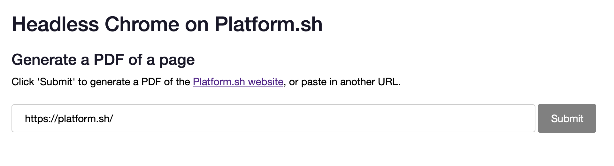
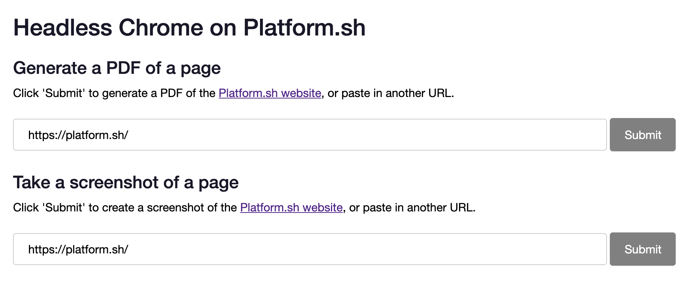

# Going Headless on Platform.sh

Intro

Some links:

* [Platform.sh Headless Chrome documentation](https://docs.platform.sh/configuration/services/headless-chrome.html)
* [Puppeteer GitHub](https://github.com/GoogleChrome/puppeteer)
* [Puppeteer documentation](https://pptr.dev/)
* [Getting Started with Headless Chrome](https://developers.google.com/web/updates/2017/04/headless-chrome)
* [page.screenshot()](https://pptr.dev/#?product=Puppeteer&version=v1.17.0&show=api-pagescreenshotoptions)
* [ExpressJS](https://expressjs.com/)

The project will ultimately have the following structure:

```bash
.
├── .platform
│   ├── routes.yaml
│   └── services.yaml
├── .platform.app.yaml
├── README.md
├── examples
│   ├── pdfs.js
│   └── screenshots.js
├── index.js
├── package-lock.json
├── package.json
└── public
    └── css
        └── style.css
```

# Configure `chrome-headless`

Define `.platform/services.yaml`

```yaml
headless:
    type: chrome-headless:73
```

Define `.platform.app.yaml`

The application `nodejs` will require Node.js 10 to use both Puppeteer and the Platform.sh [Config Reader](https://github.com/platformsh/config-reader-nodejs) library.

Three mounts are defined: one is generated during the build process `/run`, while `/screenshots` and `/pdfs` will be the writable directories that our generated files will be saved to.

A `cron` job is also defined to clear the contents of `/screenshots` and `/pdfs` every thirty minutes.

```yaml
name: nodejs

type: nodejs:10

relationships:
  headless: "headless:http"

crons:
  cleanup:
    spec: '*/30 * * * *'
    cmd: rm pdfs/* && rm screenshots/*

web:
  commands:
    start: "nodejs index.js"

mounts:
  "/run": "shared:files/run"
  "/screenshots": "shared:files/screenshots"
  "/pdfs": "shared:files/pdfs"

disk: 512
```

Using the application name we define an upstream and redirect route for the application in `.platform/routes.yaml`.

```yaml
"https://{default}/":
    id: main
    type: upstream
    upstream: "nodejs:http"

"https://www.{default}/":
    type: redirect
    to: "https://{default}/"
```

# Create a PDF generator application

Create an `index.js` in the project directory.

It builds the ExpressJS application `app`, which uses `public/` as a static source for the applications stylesheet and a rate limiter that's been defined with `express-rate-limit`.

The front page of our application will accept a url from an input field named `pdfURL` and is passed to the route `/pdfs/result`, which will actually call our `makePDF` async function using a randomly generated ID that will be used to name the generated PDF file.

Finally we use the [Config Reader](https://github.com/platformsh/config-reader-nodejs) to define the `PORT` the application will listen from. 

```
const fs = require('fs');
const uuidv4 = require('uuid/v4')
const express = require('express');
const rateLimit = require("express-rate-limit");
const platformsh = require('platformsh-config');

// Require locals
var pdfs = require("./examples/pdfs.js");

// Build the application
var app = express();

// Define static source for css
app.use(express.static(__dirname + '/public'));

// Set rate limits
app.set('trust proxy', 1);

const limiter = rateLimit({
  windowMs: 15 * 60 * 1000, // 15 minutes
  max: 50 // limit each IP to 50 requests per windowMs
});

// Apply to all requests
app.use(limiter);

// Define the index route
app.get('/', (req, res) => {
  res.writeHead(200, {"Content-Type": "text/html"});
  res.write(`<html>
<head>
    <title>Headless Chrome on Platform.sh</title>
    <link rel="stylesheet" type="text/css" href="css/style.css" />
</head>
<body>

<h1>Headless Chrome on Platform.sh</h1>

<h2>Generate a PDF of a page</h2>

Click 'Submit' to generate a PDF of the <a href="https://platform.sh/">Platform.sh website</a>, or paste in another URL.

</br></br>

<form method="get" action="/pdfs/result">
    <input type="text" name="pdfURL" value="https://platform.sh/">
    <input type="submit">
</form>
`);
    res.end(`</body></html>`);
})

// Define PDF result route
app.get('/pdfs/result', async function(req, res){
  // Create a randomly generated ID number for the current PDF
  var pdfID = uuidv4();
  // Generate the PDF
  await pdfs.makePDF(req.query['pdfURL'], pdfID)
  // Define and download the file
  const file = `pdfs/${pdfID}.pdf`;
  res.download(file);
});

// Get PORT and start the server
let config = platformsh.config();
app.listen(config.port, function() {
    console.log(`Listening on port ${config.port}`)
});

```

Create an `examples/pdfs.js` file. 


It defines and exports the async function `makePDF` which connects to Puppeteer using [Config Reader](https://github.com/platformsh/config-reader-nodejs)'s pre-formatted credentials for the library as the value for the parameter `browserURL` in `puppeteer.connect()`.

It generates a PDF of the given URL using `page.pdf()`, and saves it to the mount `pdfs/` as defined in `path`.


[page.pdf()](https://pptr.dev/#?product=Puppeteer&version=v1.17.0&show=api-pagepdfoptions)

```
const puppeteer = require('puppeteer');
const platformsh = require('platformsh-config');
var exports = module.exports = {};

// Create an async function
exports.makePDF = async function (url, pdfID) {

    try {
        // Connect to chrome-headless using pre-formatted puppeteer credentials
        let config = platformsh.config();
        const formattedURL = config.formattedCredentials("headless", "puppeteer");
        const browser = await puppeteer.connect({browserURL: formattedURL});

        // Open a new page to the given url and create the PDF
        const page = await browser.newPage();
        await page.goto(url, {waitUntil: 'networkidle2'});
        await page.pdf({
            path: `pdfs/${pdfID}.pdf`,
            format: 'letter',
            printBackground: true
        });
        await browser.close();

        return browser

    } catch (e) {
        return Promise.reject(e);
    }
};
```

In 

We'll define our dependencies in `package.json`

```json
{
  "name": "chrome_headless",
  "version": "1.0.0",
  "description": "A simple example for taking screenshots with Puppeteer and headless Chrome on Platform.sh",
  "main": "index.js",
  "scripts": {
    "test": "echo \"Error: no test specified\" && exit 1"
  },
  "author": "Chad Carlson",
  "license": "MIT",
  "dependencies": {
    "platformsh-config": "^2.0.0",
    "puppeteer": "^1.14.0",
    "express": "^4.16.4",
    "uuid": "^3.3.2",
    "express-rate-limit": "^4.0.4"
  }
}
```

Commit the changes and push to a project on Platform.sh. 

When the build process has completed, we have an application that can generate PDFs of any url a user provides!



# Create screenshots

In `index.js`, we add another variable that requires our new script `/examples/screenshots.js`.

```
// Require locals
var pdfs = require("./examples/pdfs.js");
var screenshots = require("./examples/screenshots.js");
```

We then include a new section of our front page html for a screenshot input field called `screenshotURL`

```
<h2>Take a screenshot of a page</h2>

Click 'Submit' to create a screenshot of the <a href="https://platform.sh/">Platform.sh website</a>, or paste in another URL.

</br></br>

<form method="get" action="/screenshots/result">
    <input type="text" name="screenshotURL" value="https://platform.sh/">
    <input type="submit">
</form>
```

We also define a new route `/screenshots/result` that calls a new async function `takeScreenshot()` from `screenshot.js`. Like `makePDF()` before, it accepts the input field's URL (`screenshotURL`) and a randomly generated ID number for naming the generated PNG file.

```
// Define Screenshots result route
app.get('/screenshots/result', async function(req, res){
  // Create a randomly generated ID number for the current screenshot
  var screenshotID = uuidv4();
  // Generate the screenshot
  await screenshots.takeScreenshot(req.query['screenshotURL'], screenshotID)
  // Define and download the file
  const file = `screenshots/${screenshotID}.png`;
  res.download(file);
});
```

We create an `examples/screenshot.js` file

```
const puppeteer = require('puppeteer');
const platformsh = require('platformsh-config');

var exports = module.exports = {};

// Create an async function
exports.takeScreenshot = async function (url, screenshotID) {

    try {
        // Connect to chrome-headless using pre-formatted puppeteer credentials
        let config = platformsh.config();
        const formattedURL = config.formattedCredentials("headless", "puppeteer");
        const browser = await puppeteer.connect({browserURL: formattedURL});

        // Open a new page to the given url and take the screenshot
        const page = await browser.newPage();
        await page.goto(url);
        await page.screenshot({
            fullPage: true,
            path: `screenshots/${screenshotID}.png`
        });

        await browser.close();

        return browser

    } catch (e) {
        return Promise.reject(e);
    }
};
```



# Emulate mobile devices

* [page.emulate()](https://pptr.dev/#?product=Puppeteer&version=v1.17.0&show=api-pagepdfoptions)

In `index.js`, add another input to the `screenshots form that allows users to select to emulate a mobile device named `emulateMobile`.

```
<form method="get" action="/screenshots/result">
    <input type="text" name="screenshotURL" value="https://platform.sh/">
    <input type="submit">
    </br>
    <input type="checkbox" name="emulateMobile" value=true> Emulate mobile device<br>
</form>
```

Modify the call to `takeScreenshot` to include `emulateMobile` as a parameter.

```
  // Generate the screenshot
  await screenshots.takeScreenshot(req.query['screenshotURL'], screenshotID, req.query['emulateMobile'])
```

In `screenshots.js`, require Puppeteers `DeviceDescriptors` module at the top of the file

```
const devices = require('puppeteer/DeviceDescriptors');
```

Modify `takeScreenshot` to accept `emulateMobile` with a default value of `false` and add an if statement after the new page is created that calls `page.emulate()` for the device `iPhone 6`.

```
// Create an async function
exports.takeScreenshot = async function (url, screenshotID, emulateMobile=false) {

    try {
        // Connect to chrome-headless using pre-formatted puppeteer credentials
        let config = platformsh.config();
        const formattedURL = config.formattedCredentials("headless", "puppeteer");
        const browser = await puppeteer.connect({browserURL: formattedURL});

        // Open a new page to the given url and take the screenshot
        const page = await browser.newPage();
        // Emulate mobile device if selected
        if (emulateMobile) {
            await page.emulate(devices['iPhone 6']);
        }
        await page.goto(url);
```